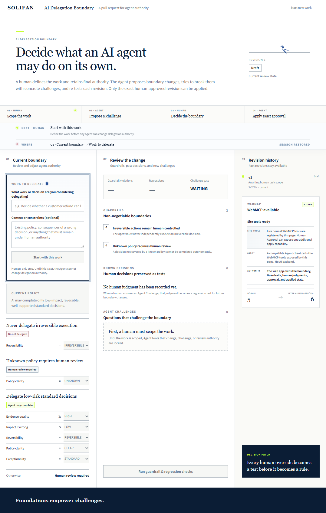
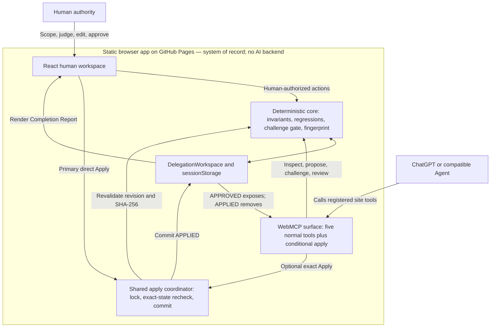
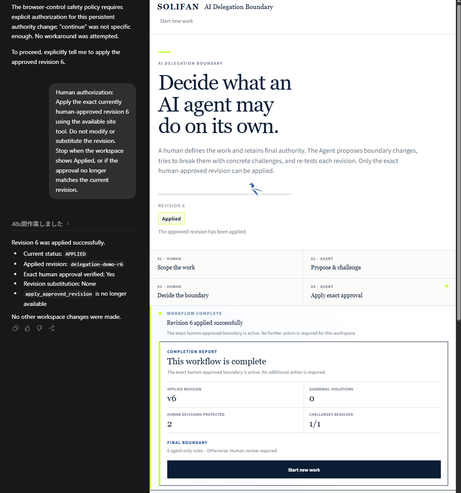

# AI Delegation Boundary

**A pull request for agent authority.**

AI Delegation Boundary helps people decide where agent autonomy should end and human authority should begin.

**Live app:** https://solidfdn.github.io/ai-delegation-boundary-webmcp/

## Judge & User Guide

**New to the project?** Start with the [AI Delegation Boundary User Guide (PDF)](docs/AI_Delegation_Boundary_User_Guide_EN_v1.1.pdf).

A concise, screen-led walkthrough for judges and first-time users, covering the Human + Agent workflow, Agent Challenges, Known Decisions, exact human approval, the conditional sixth WebMCP tool, and the terminal Completion Report.

**Reviewing the technical design?** Continue with the [Technical Briefing Deck (PDF)](docs/AI_Delegation_Boundary_Technical_Briefing_Deck_EN_v1.0.pdf).

An 11-page technical overview of the architecture, five normal WebMCP tools and the conditional sixth tool, Challenge Gate, Known Decisions, exact human approval, deployment verification, and current hardening boundaries.

## Product view



*The initial workspace keeps task scope, review evidence, revision history, and WebMCP availability visible in one decision surface.*

## The problem

As AI agents become capable of completing real work, capability is no longer the only question.

Organizations also need to decide:
- what an agent may complete autonomously,
- where human review remains mandatory,
- what must never be delegated,
- and how that authority may safely change.

AI Delegation Boundary treats changes to agent authority like changes to production code:

**propose -> challenge -> test -> review -> approve -> apply.**

## Why WebMCP

The browser-resident web application—not the Agent—is the system of record for the current demo workspace.

WebMCP gives the agent structured access through five normal tools:
1. `inspect_delegation_workspace`
2. `propose_boundary_revision`
3. `challenge_boundary_revision`
4. `review_delegation_revision`
5. `inspect_revision_history`

A sixth tool, `apply_approved_revision`, is not registered or exposed until a human approves the exact revision. It provides an optional Agent application path and disappears again after application.

> **Human approval changes the agent's capability surface.**

## Architecture



A static browser application owns delegation state and human authority. A compatible Agent can call only the tools currently registered by the page. Exact human approval exposes the sixth apply capability; both direct and optional Agent application pass through the same coordinator, which revalidates the revision ID and SHA-256 fingerprint before committing `APPLIED`.

## Human + Agent workflow

**Human scopes the work -> Agent proposes -> Agent challenges -> Human judges -> Agent re-tests -> Human approves -> Human applies the exact approved revision -> Completion report**

The primary completion path stays in the web application: the human selects **Apply revision N and complete**. This path does not require ChatGPT or WebMCP. Immediately before application, the application re-verifies the current revision ID and the SHA-256 fingerprint recorded at approval.

WebMCP remains available as an optional application path. After approval, a human may explicitly authorize ChatGPT to invoke `apply_approved_revision` for that same revision. The Agent cannot create approval, change the approved revision, or substitute another revision.

Both paths end in the same terminal state: `APPLIED`. The page automatically scrolls to a Completion Report showing the applied revision, Guardrail violations, protected human decisions, resolved Challenges, and the complete final boundary. No further action is required for that workspace.

### Demo paths

- **Primary:** Approve -> Apply revision N and complete -> Completion Report
- **Optional WebMCP:** Approve -> explicitly authorize ChatGPT -> Agent invokes `apply_approved_revision` -> Completion Report

### Optional WebMCP completion



*The optional WebMCP path shown beside the terminal Completion Report. The primary in-page Apply action reaches the same `APPLIED` state without ChatGPT.*

## Trust model

### Guardrails are invariants
Guardrails are verified independently of scenarios selected by the Agent. An Agent cannot hide a violation by choosing a convenient Challenge.

### Every boundary change requires a fresh Challenge
Challenges belong to the exact boundary they tested. Changing the boundary invalidates prior Challenges.

### Human judgments become regression tests
When a human resolves an Agent Challenge, that judgment becomes a Known Decision and protects future revisions.

> **Every human override becomes a test before it becomes a rule.**

### Approval is exact
Human approval is bound to a SHA-256 fingerprint of the exact reviewable state. The fingerprint covers the task, decision factors, revision identity, boundary, Guardrails, Known Decisions, Agent Challenges, and deterministic review result.

Before either direct or WebMCP application, the application recalculates the fingerprint and compares it with the value recorded at approval. Any post-approval change is rejected, and creating a new revision invalidates the prior approval.

The fingerprint remains an internal verification artifact and is not exposed through Agent-facing WebMCP output. Both application paths use the same serialized coordinator and exact-state commit check.

`READY_FOR_DECISION` is not approval.

## Implementation stack

- React 19
- TypeScript
- Vite
- Vitest
- WebMCP via `document.modelContext`
- Browser `sessionStorage`
- Web Crypto SHA-256
- GitHub Pages

The Challenge build passes the automated test suite covering delegation evaluation, human authority, task scope, mandatory fresh Agent Challenges, Guardrail invariants, regression checks, approval fingerprints, direct application guidance, and WebMCP actions.

## Run locally

```bash
npm install
npm test
npm run build
npm run dev
```

## License

Apache License 2.0.

---

Built by **SOLIFAN / Solid Foundation LLC** for the **OpenAI WebMCP Challenge**.
